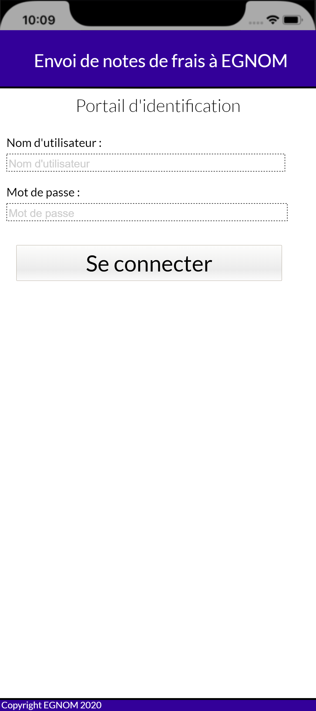
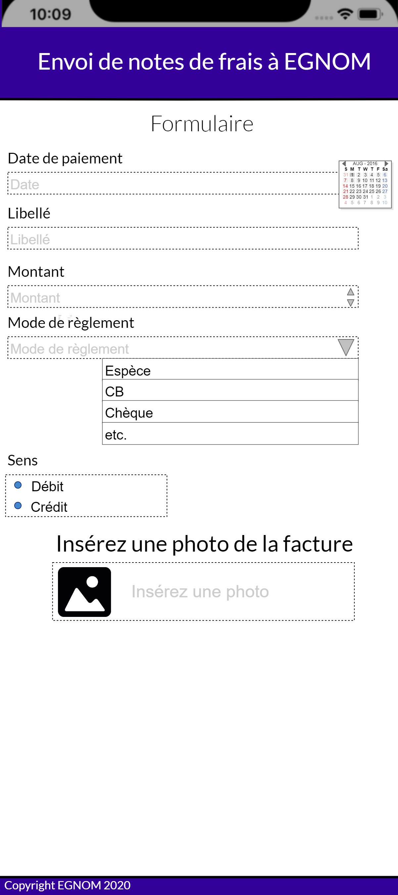

# Compte rendu projet App Dolibar
##### ETTOUIL Adel & COURTOT Lucas

## Sommaire :
[Ressources](#ressources:)    
[1. Installation de Dolibarr](#1-installation-de-dolibarr)     
[2. Recherche de solutions de développements d'applications mobiles](#2-recherche-de-solutions-de-développements-dapplications-mobiles)   
  - [Apache Cordova](#apache-cordova)  
  - [Ionic](#ionic)  
  - [Phonegap](#phonegap)       

[3. Maquette graphique](#3-maquette-graphique)

## Ressources:

**VM :**
IP : 10.0.213.57    
ID : root   
PWD : student   

[Site de Dolibarr](https://www.dolibarr.org/)   
[Module Web Services API REST (développeur)](https://wiki.dolibarr.org/index.php?title=Module_Web_Services_API_REST_(d%C3%A9veloppeur))
### Applications/modules existants:

https://www.dolistore.com/fr/modules/579-Comptabilit---des-notes-de-frais-3-8---4-0.html?search_query=note+de+frais&results=121

https://flutter.dev/
https://cordova.apache.org/docs/fr/latest/guide/overview/
https://build.phonegap.com/

## 1. Installation de Dolibarr

Git clone https://github.com/dolibarr/dolibarr -b 13.0  
cd htdocs/conf
sudo nano conf.php
apt install php7.4-intl
sudo systemctl restart apache2
sudo chmod 666 conf.php
cd var/www/html/dolibarr/
mkdir documents

sudo chmod -R 777 documents

## 
=======
[Comptabilité des notes de frais](https://www.dolistore.com/fr/modules/579-Comptabilit---des-notes-de-frais-3-8---4-0.html?search_query=note+de+frais&results=121)       
[Site de Flutter](https://flutter.dev/)

## 1. Installation de Dolibarr

`git clone https://github.com/dolibarr/dolibarr -b 13.0`    
`cd htdocs/conf`    
`sudo nano conf.php`    
`apt install php7.4-intl`   
`sudo systemctl restart apache2`    
`sudo chmod 666 conf.php`   
`cd var/www/html/dolibarr/`   
`mkdir documents`   

sudo chmod -R 777 documents`

## 2. Recherche de solutions de développements d'applications mobiles
Afin de développer des applications mobiles, nous avons trouvé ces applications :
- Flutter
  - Prise en charge du multi-plateforme
  - Complexe, mais complet
  - Développement en DART et pas en JS
- Ionic Framework
  - Prise en charge du multi-plateforme
  - Simple à installer
  - Application WEB (dev en HTML)
- Cordova
  - Prise en charge du multi-plateforme
## Apache Cordova

Apache Cordova est un framework open-source , qui permet aux développeurs web d'utiliser HTML, CSS, et JavaScript pour créer des applications multiplateformes .

Apache Cordova permet aux développeurs d'utiliser les caractéristique natives des smartphones, comme la  camera, l'enregistrement audio, l'accès à la localisation, etc. Avec Cordova, il y a de nombreux  plugins qui peuvent être ajouter à l'application.

Les avantages:

- Il est gratuit
- Facile à prendre en main
- Utilisé pour du cross-platform
- Basé sur JS
- Utilisé pour faire des applications de manière rapide et efficace
- Il existe beaucoup de plug-in pour compléter votre application et remplir toutes les demandes 
- Une bonne communauté qui peut aider à trouver des solutions rapidement aux problèmes rencontrés 

Les desavantages:

- Permet de créer des Web app ce qui diminue les perforamances 
- La vue web ne donne pas une bonne apparence à l'application 
- Pas utilisable pour les jeux ou il faudrait trop de plug-in

## Ionic

Ionic est une boite à outil open-source pour l'interface utilisateur  pour créer des applications mobiles,applications de bureau et  des progressive web app. ionic utilise HTML, CSS, and JavaScript  pour créer des applications multiplateforme de qualité. 

Ionic est un framework principalement axé  sur le front-end l'expérience utilisateur ou l'interaction avec l'interface utilisateur. Il est facile à apprendre et intégrer des librairies d'autres frameworks comme Angular, React, Cordova, etc. Officiellement , le framework Ionic a une integration avec **Angular**,  mais il fournis aussi un support pour **Vue.js** et **React.js**.

Les avantages:

- Les bases en CSS, HTML, et JavaScript frameworks suffisent, Il est ensuite très facile de développer avec .
- Ionic fournit une doc bien structuré et la doc officielle répond à la plupart des requêtes des développeurs .
- Les application ionics peuvent être déployé en multi-platform avec un seule base de code.
- L'interface utilisateur de ionic, est très personnalisable. La plateforme ionic permet à ses composants de s'adapter à la plateforme sur laquelle l'application est lancée.

Les désavantages: 

- Les performances des applications ne sont pas aussi bonnes que les applications native. malgré tout  la différence n'est pas non plus .
- Manque de sécurité par exemple des applications de banques.
- Ne peut pas utiliser les caractéristiques natives des smartphones sans utiliser cordova .
- La technologie Ionic est toujours en développement donc les support changent régulièrement et ses librairies peuvent être complètement réécrites à n'importe quel moment.

## Phonegap
Phonegap est un framework open-source largement adopté pour le développement d'applications mobiles multiplateformes. Il permet aux développeurs de créer une application à l'aide de technologies Web telles que HTML, CSS et JavaScript. Il crée une application pour toutes les plates-formes populaires telles que iOS et Android. Il est développé et maintenu par Adobe Systems.

Phonegap est le meilleur framework si vous souhaitez créer une application Web mobile simple avec le toucher d'une application native. Nous pouvons développer une application en utilisant le framework Phonegap et la déployer sur plusieurs plates-formes sans réécrire le code à nouveau.

Avantages de Phonegap:

- Open-Source: Phonegap est open-source, qui fournit la plupart de ses fonctionnalités gratuitement.

- Cross-Platform: Phonegap est une multiplate-forme fiable qui permet aux développeurs d'écrire un seul code et s'exécute sur diverses plates-formes telles que iOS et Android.

- Facilité de développement: Phonegap fonctionne sur des technologies Web telles que HTML, CSS et JavaScript qui prennent en charge tous les navigateurs. Cela facilite le développement de l'application.

- Flexibilité: il offre une grande flexibilité aux développeurs pour développer tout type d'application mobile sans aucun effort sérieux. Il n'est pas nécessaire d'apprendre des langages supplémentaires autres que HTML, CSS et JavaScript.

- Bibliothèques: Il dispose d'une variété de bibliothèques, ce qui contribue à améliorer les fonctionnalités de la plate-forme.

- Solide et robuste soutenu: Phonegap dispose d'un système backend robuste qui réduit les efforts du développeur et accélère le processus de développement.

Inconvénients de Phonegap:

- Performances: les performances de l'application Phonegap sont lentes car elle contient de nombreux éléments graphiques dans l'application mobile.

- Manque d'informations claires: en termes de codage, la directive appropriée n'est pas mentionnée. Ainsi, programmer une application de la superbe interface est devenu fastidieux pour le développeur.

- Mauvaise documentation: La documentation de Phonegap n'est pas très descriptive. Par conséquent, il est très difficile pour un programmeur d'utiliser efficacement cette plate-formes.

## 3. Maquette graphique
Nous avons réalisé une maquette graphique qui correspondra au projet :

## 4. Développement de l'application

1. : Développer dans un page web
2. : Utiliser l'API de Dolibarr
3. : Authentifier par "token"
4. : (Régler le problème de CORS)
5. : Ajouter des informations dans Dolibarr
6. : Encapsuler la page web avec "Cordova"
7. : Ajouter le plugin photo de "Cordova"

## 5. Déploiement de la solution

1) déploiement interne

Un mail est envoyé avec une explication concernant sont installation et un guide d'utilisation joint.

2) Commercialisation

A/ La protection des logiciels est particulière car c'est une œuvre de l'esprit donc les protections sont moindre. Cependant comme toutes les œuvre de l'esprit les applications bénéficient de la protection par les droits d'auteurs. 

Celle-ci s'applique sous quelques conditions:

- une œuvre de l'esprit: Aujourd'hui les les applications sont considérées comme des œuvre de l'esprit car leur création tire de la propriété intellectuel.
- une création original: C'est le cœur du droit d'auteur il faut que l'application soit entièrement issue de l'esprit de son créateur, qu'il soit original.
- une création élaboré: Il faut que l'application soit assez poussé dans sa création pour qu'elle soit considérée comme tel
- Absence de formalité obligatoire: C'est à dire qu'il ne faut faire aucune démarche particulière 

B/ Les applications sont toujours protégé par le droit d'auteur mais comment est définie sont titulaire. De manière générale c'est l'auteur de l'œuvre. Mais dans le cas particulier ou l'auteur est salarié le titulaire du droit sera l'employeur. Ce cas particulier s'applique sous deux conditions:

- Que la personne soit bien un salarié de l'entreprise.
- Que le logiciel est été créé par la demande de l'employeur, dans le cadre de l'entreprise et durant les heures de travail.

